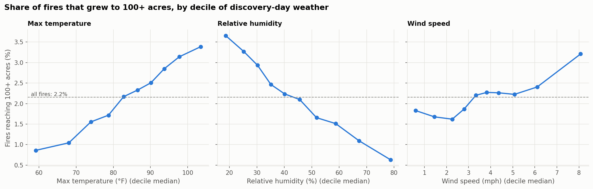
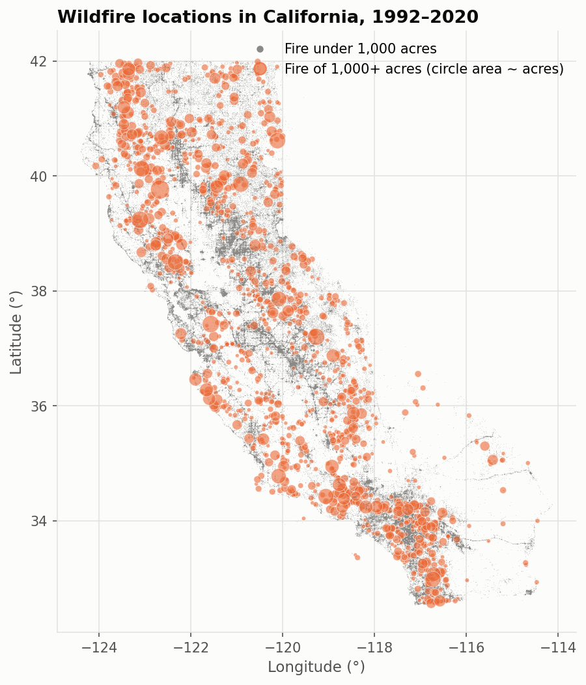
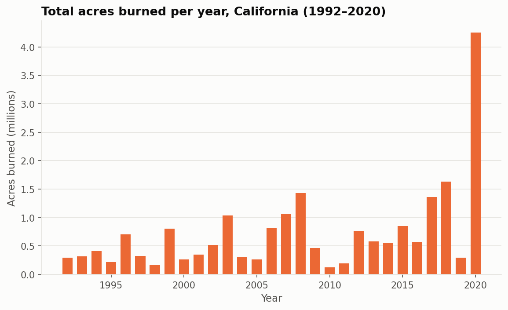
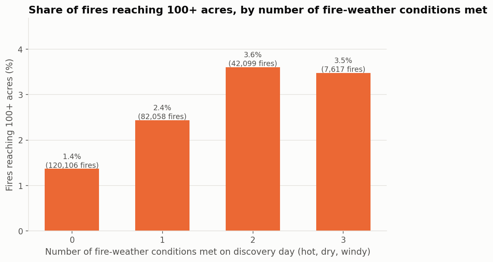
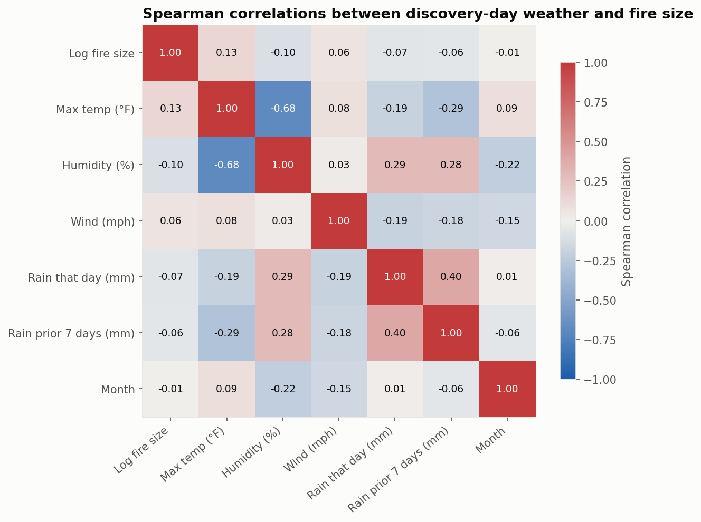

# California Wildfire Risk & Weather Analysis

An analysis of **251,880 California wildfires (1992–2020)** matched with daily NASA weather data, exploring how
temperature, humidity, wind, and rainfall are associated with how often fires occur and how large they become.



## Overview

This project combines two public datasets, the U.S. Forest Service's national wildfire record database and
NASA's POWER daily weather data. Each fire is matched to the weather at the nearest NASA grid point on the day
it was discovered. The analysis covers data cleaning, dataset merging, exploratory analysis, correlation
analysis, and a baseline machine learning model. The findings are stated as associations, not causes.

## Research Question

**How are weather conditions associated with California wildfire occurrence and wildfire severity?**

## Motivation

Wildfires in California affect ecosystems, air quality, property, and public safety. Weather is commonly described
as a driver of fire behavior. This project checks how much of that relationship is visible in historical records
when each fire is linked to the weather on its discovery day, and where that simple approach falls short.

## Data Sources

| Dataset | Organization | Link | Variables used |
|---|---|---|---|
| Spatial wildfire occurrence data for the United States, 1992–2020 (FPA FOD, 6th ed.) | USDA Forest Service Research Data Archive | [doi.org/10.2737/RDS-2013-0009.6](https://doi.org/10.2737/RDS-2013-0009.6) | discovery date, fire size (acres), size class, latitude, longitude, county, cause |
| NASA POWER Daily API (MERRA-2 meteorology) | NASA Langley Research Center | [power.larc.nasa.gov](https://power.larc.nasa.gov/docs/services/api/temporal/daily/) | daily max temperature, relative humidity, wind speed at 2 m, precipitation |

Citation: Short, Karen C. 2022. *Spatial wildfire occurrence data for the United States, 1992-2020
[FPA_FOD_20221014]*. 6th Edition. Fort Collins, CO: Forest Service Research Data Archive.

The raw data files are too large for GitHub, so they are not included. See [How to Run](#how-to-run) to download them.

## Tools

Python · pandas · NumPy · matplotlib · scikit-learn · Jupyter Notebook · SQLite · Git/GitHub

## Methodology

1. **Data collection:** California records (251,881) were loaded from the FPA FOD SQLite database with a SQL
   query. Daily weather for December 1991 to December 2020 was downloaded from the NASA POWER API for the
   176 grid points nearest to California fires.
2. **Data cleaning** ([02](notebooks/02_data_cleaning.ipynb)):
   - Converted text dates to datetime and standardized column names.
   - Checked for duplicates (none found) and for impossible values. One fire located outside California was
     removed.
   - Kept the 38% of records that have no county instead of dropping them.
   - Replaced NASA's `-999` missing-value code, converted °C to °F and m/s to mph, and computed rainfall over
     the prior 7 days.
3. **Dataset merging:** matched each fire to the NASA grid point nearest to its location (grid spacing 0.5° ×
   0.625°, roughly 55 km), using weather on the fire's discovery date. All 251,880 fires matched.
4. **Exploratory analysis** ([03](notebooks/03_exploratory_analysis.ipynb)): fires and acres by year, month,
   and county, the size distribution, and a map.
5. **Statistical analysis** ([04](notebooks/04_statistical_analysis.ipynb)):
   - Pearson and Spearman correlations with fire size, raw and log-transformed.
   - Share of large fires by weather decile.
   - A combined hot/dry/windy analysis.
6. **Modeling** ([05](notebooks/05_modeling.ipynb)): predicted log fire size with a baseline, Linear
   Regression, and a Random Forest. Models were evaluated with both a random 80/20 split and a time-based split
   (1992–2014 → 2015–2020).

Because fire size is extremely skewed (median 0.2 acres, maximum 589,368 acres), the analysis relies on
medians, the share of fires reaching **100+ acres** ("large," NWCG size classes D–G), and
`log(1 + acres)` rather than raw averages.

## Key Questions

1. Are larger wildfires associated with higher temperatures?
2. Are larger wildfires associated with lower humidity?
3. Is wind speed associated with wildfire size?
4. During which months do the most fires occur?
5. During which months are the largest fires observed?
6. Which parts of California experience the most wildfire activity?
7. How has wildfire activity changed from 1992 to 2020?
8. Do combinations of hot, dry, and windy conditions correspond with larger fires?
9. Can basic weather variables help predict how large a fire becomes?

## Key Findings

- **Most fires are small, and a few large fires account for nearly all of the burned area.**
  - 93% of recorded fires burned under 10 acres, and only 2.2% reached 100 acres.
  - That 2.2% of fires accounts for 97.5% of all acres burned.
- **Temperature and humidity (Q1–2):** both relationships are weak but consistent in direction.
  - Spearman correlation with fire size is ρ = 0.13 for max temperature and ρ = −0.10 for relative humidity.
  - About 0.9% of fires discovered on the coolest tenth of days reached 100+ acres, compared with 3.4% on the
    hottest tenth.
  - For humidity, the share was 3.7% on the driest tenth of days and 0.6% on the most humid tenth.
- **Wind (Q3):** very weak (ρ = 0.06). One likely reason is that daily-average wind at 2 m over a ~55 km grid
  cell misses the gusts that drive fire spread.
- **Season (Q4–5):**
  - The most fires were discovered in July (53,011).
  - The highest share of fires growing to 100+ acres was in August (2.9%) and June (2.7%), compared with under
    1% from December through March.
- **Location (Q6):**
  - Riverside, Los Angeles, and Fresno counties recorded the most fires.
  - Siskiyou and Trinity counties in the far north had the most total acres burned.
  - These rankings are limited because 38% of records have no county listed.
- **Over time (Q7):**
  - The number of recorded fires per year shows no clear trend (roughly 6,500–13,400).
  - 2020 had by far the most area burned (4.25 million acres), followed by 2018 (1.64 million) and 2008
    (1.43 million).
- **Hot + dry + windy (Q8):**
  - The share of fires reaching 100+ acres was 1.4% on days meeting none of the three conditions, 2.4% with
    one, and 3.6% with two.
  - Days meeting all three conditions were not higher (3.5%).
  - Dry and windy days that were not hot had the highest rate, at 5.3%.
- **Prediction (Q9):**
  - Discovery-day weather is a poor predictor of final fire size.
  - A Random Forest explained **3.5%** of the variation in log fire size on a random test split (Linear
    Regression: 1.9%).
  - When predicting 2015–2020 from earlier years, neither model beat a simple average (R² ≈ 0).

**Bottom line:** hotter, drier conditions on the discovery day are consistently associated with a higher chance
that a fire becomes large. However, weather alone explains very little of why one fire grows and another does
not.

## Visualizations

| | |
|---|---|
|  |  |
|  |  |

More figures are in [`figures/`](figures/).

## Repository Structure

```
california-wildfire-weather-analysis/
├── data/
│   ├── raw/            # Downloaded source data (not on GitHub; see How to Run)
│   └── processed/      # Cleaned, merged table created by notebook 02 (not on GitHub)
├── notebooks/
│   ├── 01_data_exploration.ipynb     # First look at the wildfire data, data-quality notes
│   ├── 02_data_cleaning.ipynb        # Cleaning, weather matching, row counts at each step
│   ├── 03_exploratory_analysis.ipynb # Summary tables and charts
│   ├── 04_statistical_analysis.ipynb # Correlations, deciles, hot/dry/windy analysis
│   └── 05_modeling.ipynb             # Baseline, Linear Regression, Random Forest
├── src/
│   ├── data_cleaning.py      # Loading, cleaning, grid matching functions
│   ├── download_weather.py   # Downloads NASA POWER weather for every grid cell
│   ├── analysis.py           # Correlation and decile summary helpers
│   └── visualization.py      # Shared chart style
├── figures/            # Saved charts (PNG)
├── results/            # Small output tables (correlations, model metrics)
├── docs/
│   ├── data_dictionary.md    # Every column in the final table, with units
│   └── INTERVIEW_GUIDE.md    # How to explain this project
├── requirements.txt
└── LICENSE             # MIT
```

## How to Run

```bash
git clone https://github.com/MihirRao008/california-wildfire-weather-analysis.git
cd california-wildfire-weather-analysis
python3 -m venv .venv
source .venv/bin/activate          # Windows: .venv\Scripts\activate
pip install -r requirements.txt
```

**Download the data**

1. **Wildfires:** download `RDS-2013-0009.6_Data_Format4_SQLITE.zip` (214 MB) from the
   [Forest Service archive](https://www.fs.usda.gov/rds/archive/catalog/RDS-2013-0009.6). Unzip it, and move
   `FPA_FOD_20221014.sqlite` and `_variable_descriptions.csv` into `data/raw/`.
2. **Weather:** run `python src/download_weather.py`. No API key is needed, and it takes about 5–10 minutes.
   It writes `data/raw/nasa_power_daily_ca.csv`.

**Run the notebooks in order:**

```bash
jupyter notebook
```

Run notebooks `01` → `05`. Notebook 02 creates `data/processed/wildfires_with_weather.csv`, which notebooks
03–05 use.

## Limitations

- **Spatial matching:** weather is a modeled average over a ~55 km grid cell, not the conditions at the fire.
  Terrain, elevation, and coastal effects inside a cell are lost.
- **Timing:** only discovery-day weather is used. Large fires burn for days or weeks under changing weather.
- **Daily averages:** daily-average humidity and 2 m wind speed understate the afternoon lows and gusts that
  drive fire spread.
- **Incomplete records:**
  - County is missing for 38% of fires and the cause is undetermined for 38%.
  - Reporting practices differ between agencies and changed over time. For example, the median recorded size
    dropped to 0.1 acres in 2014–2019.
  - Small-fire sizes are often rounded.
- **Missing drivers:** vegetation and fuel, topography, suppression effort, ignition source, and distance to
  roads and communities are not included.
- **Climate trends:** a 29-year window cannot separate long-term climate change from year-to-year variation.
- **Associations only:** this is observational data, so none of the relationships shown are causal.

## Future Work

- Add fuel and vegetation data (e.g. LANDFIRE) and live fuel moisture.
- Add a drought index (U.S. Drought Monitor, 2000 onward) and elevation and slope.
- Use higher-resolution weather (gridMET, 4 km) and weather over the full burn period rather than one day.
- Model the probability that a fire becomes large (classification) and try gradient-boosted models.
- Match fires to counties spatially to fill in the missing county names.

## Author

**Mihir Rao**, undergraduate student in Information Sciences + Data Science, University of Illinois
Urbana-Champaign

## License

[MIT](LICENSE)
